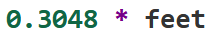
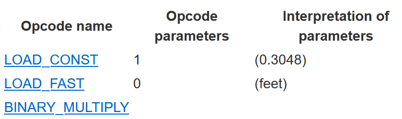
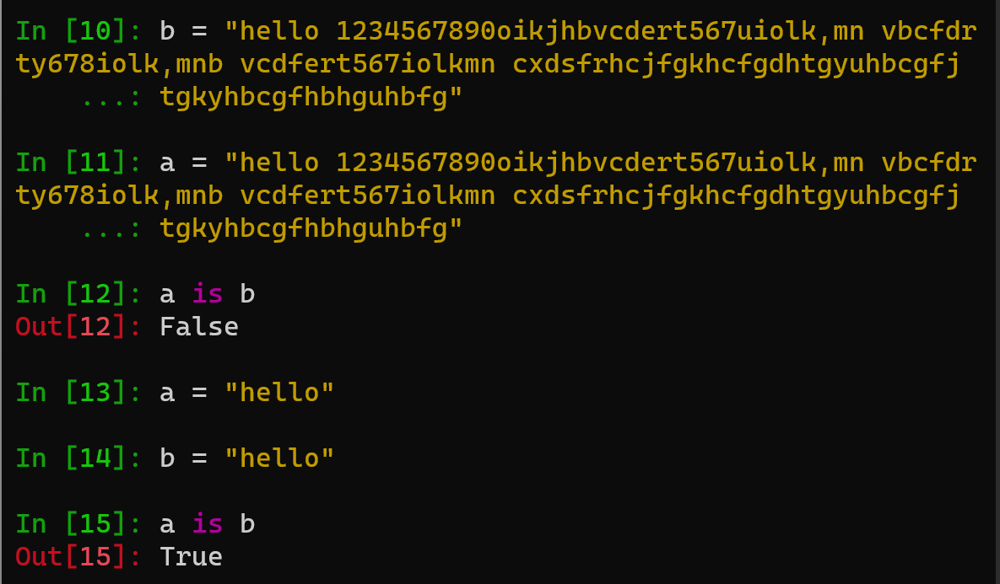

# What?
in 
[this](https://www.youtube.com/playlist?list=PLzV58Zm8FuBL6OAv1Yu6AwXZrnsFbbR0S)
youtube playlist we got a code-walk of cpython 2.7 source code from 
[Philip Guo](https://pg.ucsd.edu/)

here i am going to make some random notes from this playlist

### not a very old version?

Yes python 2.7 is old but lots of concepts still exist in latest version of python (3.12) 
i will try my best to translate most of  my notes to newer versions of python 

 

## Lecture  1,2,3

- there is a compiler that generates bytecode then an interperter runs the bytecode
- you can see the bytecode with compile function (a builtin function)
- you can see meaningful version of this bytecode with dis module :  `python -m dis filename.py` or for seeing bytecode of a function: `import dis; dis.dis(thefunc)`
- `dis.dis(moudle)` display both of them (i mean imported code)
- bytecode is consist of some oprator ids and some oprator args 
- you can see list of cpython oprators in `opcode.h` file (moved to [this](https://github.com/python/cpython/blob/main/Include/opcode_ids.h) file) 
- oprators with opcode below `HAVE_ARGUMENT` will need some argument
- you can see a summery of oprators [here](https://docs.python.org/3/library/dis.html#opcode-NOP) in python docs. but note that it can change based on python version for example `BINARY_MULTIPLY` is no longer in 3.11 version and its replaced with BINARY_OP with an argument
- oprators store working data in a value stack  

consider this piece of code:   

it will compiled to following bytecodes in 3.10 version:

- the `BINARY_MULTIPLY` opcode will pop two values from value stack and push the result of multiply back to value stack (note that this oprator dosn't have any argument)
- you can try python dis [here](https://www.dis-this.com) online
- value stack is an array of refrences to python objects ( so type of it is **PyOject)
- every variable and function is a PyObject in python we will see this in next lesson in more details
- there is a main loop in the code in `ceval.c` file which runs the bytecodes (i think a lot of main loop code is moved to [here](https://github.com/python/cpython/blob/main/Python/generated_cases.c.h)) ([main loop](https://github.com/python/cpython/blob/d4cea794a7b9b745817d2bd982d35412aef04710/Python/ceval.c#L762C7-L762C24))

- <b>don't confuse code object, function and frame:</b> code object is the byte code of a function , every function itself have its code object, its name and its runing envirement (i think this is equal to the global of the function) and a frame is a run time instance of a function
- there is a `PyEval_EvalFrameEx` function in `ceval.c` file whtch runs a frame in its env (code+inputs+globals)
(this function still exist in python 3.12 but the code is moved some where else)
- the `_frame` struct is [here](https://github.com/python/cpython/blob/d4cea794a7b9b745817d2bd982d35412aef04710/Include/internal/pycore_frame.h#L20) in 3.12 version but it has a small changes from 2.7 version
- some parts of `PyFrameObject` is defined in `_PyInterpreterFrame` in 3.12
- the frame has a link to it's previous frame (so there a link list of frames)
- each frame has its own [value] stack
- localsplus is locals + value stack (this is for optimization resons )(both are **PyObjct)

- main loop is in `PyEval_EvalFrameEx` function ( it's code is in `_PyEval_EvalFrameDefault` in 3.12)

- the `PyCodeObject` is imutable (defined [here](https://github.com/python/cpython/blob/d4cea794a7b9b745817d2bd982d35412aef04710/Include/cpython/code.h#L114)) this is same thing that compile function give us it (look at it's attributes)

- there is a `CALL_FUNCTION` opcode which makes a new `PyFrameObject` and run the code of this function in it's env ( bytecodes are in PyCodeObject and code object is in function ) (in 3.12 it's `CALL_FUNCTION_EX`)

- this will call `PyEval_EvalFrameEx` again for this function with corsponding frame (in 3.12 it's `_PyEval_EvalFrame` which  is very similar to `_PyEval_EvalFrameDefault`)

## Lecture 4

some of bullets is taken from [here](https://github.com/python/cpython/blob/main/Objects/frameobject.c)

- all peice of data is a PyObject 
- python object protocol -> methods that all objects shoud impliment
- allocated on the heap
- Objects that must hold variable-size data can contain pointers to variable-size parts of the object. the size of pyobject itself cannot change after allocation.
- 'PyObject' contains the reference count and the type pointer
- A standard interface exists for objects that contain an array of items whose size is determined when the object is allocated
- for example in `PyFloatObject` there is `double` and a `PyObject_HEAD` [code here](https://github.com/python/cpython/blob/main/Include/cpython/floatobject.h)
- I can't find `PyIntObject` in 3.12 code !!!

## Lecture 5

- lecturer explained some details aboat list and tuple implimentations
- `Stringobject.h` is no longer in cpython ([unicodeobject.h](https://github.com/python/cpython/blob/main/Include/cpython/unicodeobject.h) is somehow the replacement)

- python uses an algoritm called [String interning](https://en.wikipedia.org/wiki/String_interning) (only one copy of each distinct string)
- becuse of this interning `is` oprator on equal short strings is true but on longer strings is false 

- on minute 32 lecturer explained difference of `PyUnicode_Check` and `PyUnicode_CheckExact`
- PyVarObject has an ob_size attribute
- there is lots of changes here from python 2.7 to 3.12
- class goes on following the string equality check specialy the richcompare i coud't follow in source code (hint: search for `PyUnicode_RichCompare`)
- i think [this](https://github.com/python/cpython/blob/8a82bff12c8e6c6c204c8a48ee4993d908ec4b73/Objects/typeobject.c#L5614) is equivalent point in py3.12 source code where we call richcompare of a arbitrary pyobject 
- similary i can't find `PyUnicode_Concat` defenition in source code!! (only header file and usage!) 

## Lecture 6

- functions are also PyObject in cpython
- you can see global scope of a function with `foo.__globals__` in python 3.12 (each file can have its globals)
- lecturer explained `PyCodeObject` again 
- `PyTypeObject` is some part of the trick that make pyobject act like an object (c lang is not oop) you shoud impliment lots of things in any pyobject (for example [here](https://github.com/python/cpython/blob/d5611f280403d19befe4a3e505b037d286cf798e/Objects/codeobject.c#L1275C1-L1275C13)) in PyTypeObject  (PyCodeObject not an exception)
- when you run a python file it compiles at fisrt step so all `PyCodeObject`s where created but when interpreter get to the point of `def` it makes a function that pointed to coresponding `PyCodeObject`
- still same signature for `PyFunction_New` function ([link](https://github.com/python/cpython/blob/d5611f280403d19befe4a3e505b037d286cf798e/Objects/funcobject.c#L315))
- `PyMemberDef` is where you can expose some c attributes of your cpython PyObject to python code (acts like a map) (is it read only?) (how differs from `PyGetSetDef`)
- i couldn't find equivalent of `function_call` (looked in `./Objects/funcobject.c` file)
- nested functions use a diffrent global (enclosure is also explaied)
- i think python3 have a lot of diffences here (python2 copy variables from parent frame to the function object but in python3 it's not the case (`nonlocal`??) (python2 is more similar to javascript in closures??))
- pyhton 3 have an extera `qualname` argument for making a `PyFunctionObject` (look [here](https://github.com/python/cpython/blob/e8be0c9c5a7c2327b3dd64009f45ee0682322dcb/Objects/funcobject.c#L140C1-L140C27))
- i got confused again about how `func_closure` is not declead in the [header file](https://github.com/python/cpython/blob/e8be0c9c5a7c2327b3dd64009f45ee0682322dcb/Include/cpython/funcobject.h#L36C5-L36C5) of `PyFunctionObject` but is used as its attribute a lot
- bound variable vs free variable explained (it calld free becuse we don't know where it comes from)

## Lecture 7
- i lost intrest in the video series i will decide at the end of this video
- this lesson is about iterators in python
- you can make multi itrators on a single list
- I just noticed a big diffrence in py3 vs py2. globals are no longer `PyObject **` but they are `PyObject *`  how this is possible? (theoriticaly it can be variable that contains first pyobject adderss so we can find address of it (the pointer to pointer) and go to the next pyobject address)(list items are still `PyObject **` in py3.  [link](https://github.com/python/cpython/blob/e8be0c9c5a7c2327b3dd64009f45ee0682322dcb/Include/cpython/listobject.h#L5))
